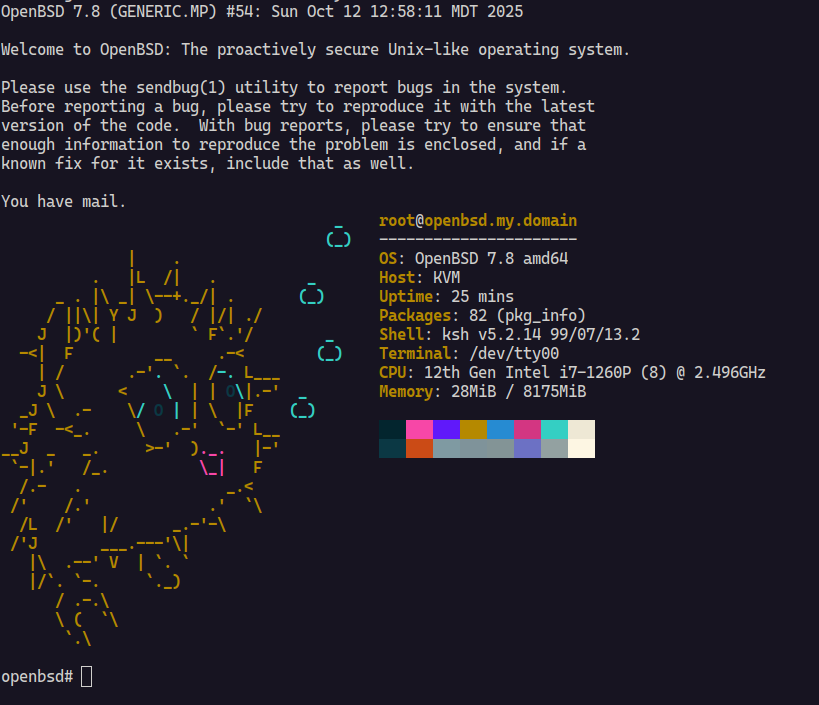

# 🐡 openbsd-up

A comprehensive CLI tool to manage OpenBSD virtual machines using QEMU with
minimal fuss. Create, start, stop, and manage multiple OpenBSD VMs with
persistent state tracking.



## ✨ Features

- 🚀 **Quick Start**: Launch OpenBSD VMs with a single command
- 📦 **Auto-Download**: Automatically fetches OpenBSD ISO images from official
  CDN
- 🔢 **Version Support**: Specify any OpenBSD version (e.g., `7.8`, `6.4`)
- 💾 **Flexible Storage**: Support for persistent disk images in multiple
  formats with auto-creation
- ⚙️ **Configurable**: Customize CPU, memory, cores, and more
- 🌐 **Network Ready**: Support for both NAT (SSH port forwarding) and bridge
  networking
- 📝 **Serial Console**: Direct terminal access via `-nographic` mode
- 🗃️ **VM Management**: Persistent state tracking with SQLite database
- 📋 **VM Lifecycle**: Start, stop, list, and inspect VMs with unique names
- 🎯 **Smart Detection**: Automatically detects existing disk images to avoid
  data loss
- 🔗 **Bridge Support**: Automatic bridge network creation and QEMU
  configuration

## 🛠️ Requirements

- [Deno](https://deno.com) runtime
- QEMU with KVM support (`qemu-system-x86_64`)
- `curl` for downloading ISOs
- `sudo` access (for bridge networking only)

## 📥 Installation

```bash
deno install -A -g -r -f jsr:@tsiry/openbsd-up
```

## 🎯 Usage

### Basic Examples

```bash
# Launch latest default version (7.8) - creates a new VM with random name
openbsd-up

# Launch specific OpenBSD version
openbsd-up 7.6

# Use local ISO file
openbsd-up /path/to/openbsd.iso

# Download from custom URL
openbsd-up https://cdn.openbsd.org/pub/OpenBSD/7.8/amd64/install78.iso
```

### VM Management

```bash
# List running VMs
openbsd-up ps

# List all VMs (including stopped)
openbsd-up ps --all

# Start a specific VM by name or ID
openbsd-up start my-vm-name

# Stop a running VM
openbsd-up stop my-vm-name

# Inspect VM details and configuration
openbsd-up inspect my-vm-name
```

### Advanced Configuration

```bash
# Custom VM with persistent disk (auto-created if needed)
openbsd-up 7.8 \
  --cpus 4 \
  --memory 4G \
  --cpu host \
  --drive disk.img \
  --disk-format qcow2 \
  --size 40G

# Bridge networking (requires sudo)
openbsd-up 7.8 --bridge br0

# Save downloaded ISO to specific location
openbsd-up 7.8 --output ~/isos/openbsd-78.iso
```

## 🎛️ Command Line Options

### Global Options

| Option          | Short | Description                                                  | Default        |
| --------------- | ----- | ------------------------------------------------------------ | -------------- |
| `--output`      | `-o`  | Output path for downloaded ISO                               | Auto-generated |
| `--cpu`         | `-c`  | CPU type to emulate                                          | `host`         |
| `--cpus`        | `-C`  | Number of CPU cores                                          | `2`            |
| `--memory`      | `-m`  | RAM allocation                                               | `2G`           |
| `--drive`       | `-d`  | Path to persistent disk image                                | None           |
| `--disk-format` |       | Disk format (qcow2, raw, etc.)                               | `raw`          |
| `--size`        |       | Size of disk image to create if it doesn't exist             | `20G`          |
| `--bridge`      | `-b`  | Name of the network bridge to use for networking (e.g., br0) | None           |

### Subcommands

| Command          | Description                                    | Example                    |
| ---------------- | ---------------------------------------------- | -------------------------- |
| `ps`             | List virtual machines                          | `openbsd-up ps --all`      |
| `start <name>`   | Start a stopped VM by name or ID               | `openbsd-up start my-vm`   |
| `stop <name>`    | Stop a running VM by name or ID                | `openbsd-up stop my-vm`    |
| `inspect <name>` | Show detailed VM information and configuration | `openbsd-up inspect my-vm` |

## 🖥️ Console Setup

When OpenBSD boots, you'll see the boot loader prompt, enter the following
command:

```
set tty com0
boot
```

## 🔌 Networking

The tool supports two networking modes:

### NAT Mode (Default)

- **SSH Port Forward**: `localhost:2222` → VM port `22`
- **Network Device**: Intel E1000 emulated NIC
- No special privileges required

### Bridge Mode

- **Direct Bridge Access**: VM gets IP from bridge network
- **Network Device**: Intel E1000 emulated NIC with custom MAC
- Requires `sudo` privileges for QEMU bridge access
- Automatically creates bridge network if it doesn't exist
- Sets up QEMU bridge configuration in `/etc/qemu/bridge.conf`

Connect via SSH after installation:

```bash
# NAT mode
ssh -p 2222 user@localhost

# Bridge mode (use VM's actual IP)
ssh user@<vm-ip-address>
```

## �️ VM State Management

`openbsd-up` automatically tracks VM state using a SQLite database stored in
`~/.openbsd-up/state.sqlite`. Each VM gets:

- **Unique ID**: Auto-generated CUID for reliable identification
- **Random Name**: Human-readable names (e.g., `ancient-butterfly`) for easy
  reference
- **Persistent Config**: CPU, memory, disk, and network settings preserved
- **Status Tracking**: RUNNING/STOPPED status with process ID tracking
- **MAC Address**: Consistent network identity across restarts

The state database allows you to:

- Resume VMs exactly as configured
- List all VMs with their current status
- Start/stop VMs by name or ID
- Inspect detailed VM configurations

## �💡 Tips

- 🐏 Allocate at least 2GB RAM for smooth installation
- 💿 ISOs are cached - re-running with same version skips download
- 📀 Disk images are auto-created if `--drive` path doesn't exist
- 🔒 Tool detects non-empty disk images and skips ISO mounting to prevent data
  loss
- 🏷️ Use VM names for easy management: `openbsd-up start my-web-server`
- 🌉 Bridge networking requires sudo but provides direct network access
- 📊 Use `openbsd-up ps --all` to see both running and stopped VMs

### Creating Persistent VMs

```bash
# Create a VM with persistent storage
openbsd-up 7.8 --drive my-server.qcow2 --disk-format qcow2 --size 40G

# Later, restart the same VM (no ISO needed for installed systems)
openbsd-up start <vm-name>
```

## 🔧 Architecture

Built with modern TypeScript and Deno, featuring:

- **CLI Framework**: [Cliffy](https://cliffy.io/) for robust command-line
  interface
- **Database**: SQLite with [Kysely](https://kysely.dev/) query builder for
  type-safe operations
- **State Management**: Persistent VM state tracking with migrations
- **Dependencies**: Minimal runtime dependencies, leveraging Deno's built-in
  capabilities
- **Unique IDs**: CUID2 for collision-resistant VM identifiers
- **Human Names**: Moniker for memorable VM names

## 📄 License

See [LICENSE](LICENSE) file for details. Licensed under Mozilla Public License
v2.0.

## 🤝 Contributing

Issues and pull requests welcome!

---

Made with 🐡 for OpenBSD enthusiasts
